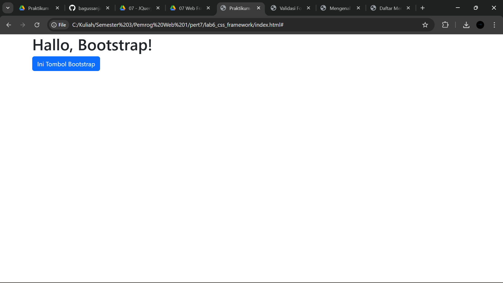
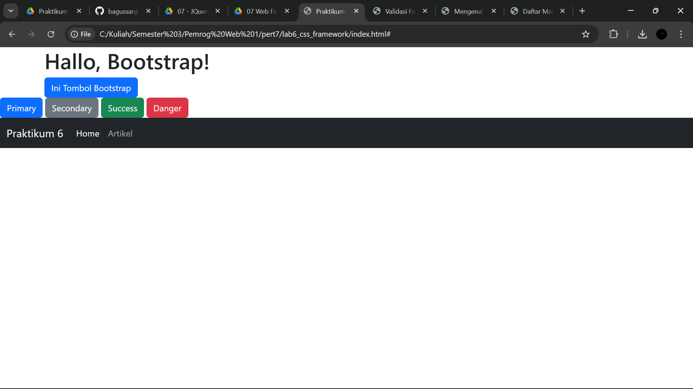
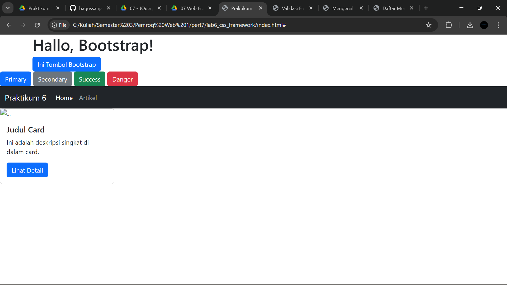
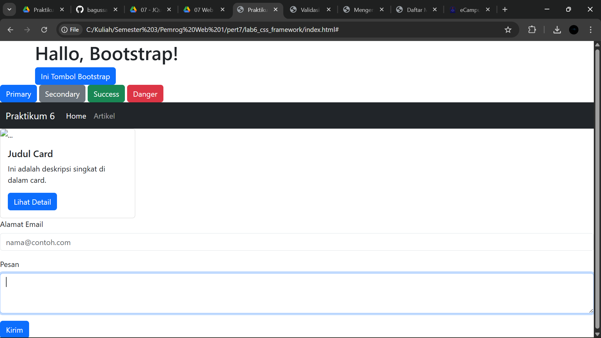
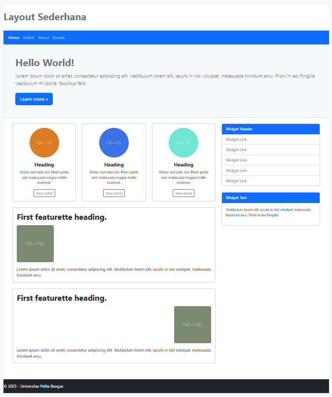
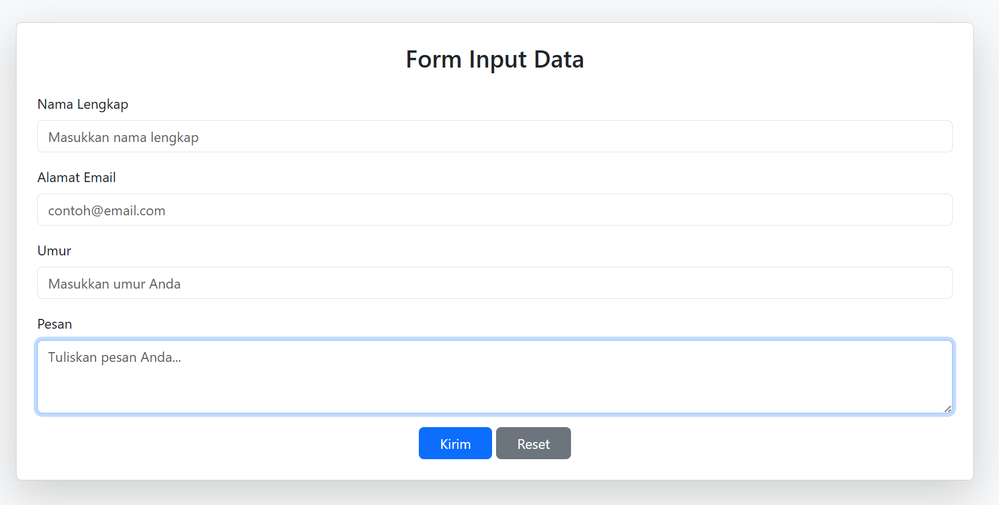
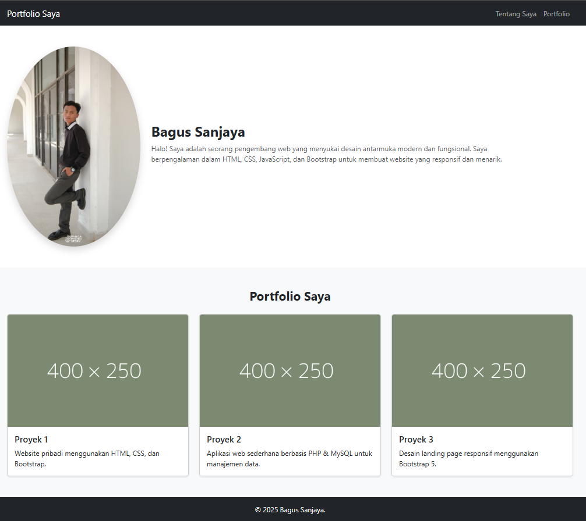

# Lab6Web

Nama : Bagus Sanjaya

Nim : 312410505

Kelas : TI.24.A.5

## Pertanyaan

1. Kerjakan semua latihan yang diberikan sesuai urutannya. Screenshot setiap perubahannya.

## Jawaban

1. 

## Pertanyaan

2. Refactor Layout Praktikum 4

Ambil layout web sederhana dari Praktikum 4. Buat ulang layout tersebut menggunakan Bootstrap Grid System.

- Gunakan `<nav>` Bootstrap untuk bagian navigasi

- Gunakan class `.row` dan `.col-md-8` untuk main content dan `.col-md-4` untuk sidebar

- Gunakan komponen `.card` Bootstrap untuk menggantikan `.widget-box`

- Gunakan komponen `.card` untuk menggantikan `.box` (bagian "Heading" yang berisi 3
kolom)

- Anda tidak diperbolehkan menggunakan CSS float atau clear manual.

## Jawaban

2. 

- html ini berbasis Bootstrap 5, tanpa menggunakan CSS float atau clear manual, dan semua tata letaknya sudah diatur dengan Bootstrap Grid System dan Flexbox.

- Struktur utama: Header - Navbar - Hero - Main (3Card + Featurette) - Sidebar - Footer

- Komponen utama Bootstrapnya: `.container`, `.row`, `.col-md-*`, `card`, `.navbar`, `.btn`, `.list-group`

- file html-nya bisa diakses pada file `home.html`

## Pertanyaan

3. Refactor Form Praktikum 5

Ambil salah satu form dari Praktikum 5 (misalnya Form Input 23atau Form Button 24).

Buat ulang form tersebut agar terlihat rapi menggunakan class-class form Bootstrap (`.form- control, .form-label, btn`).

## Jawaban

3. 

- Pada file ini saya membuat Form Input(23) menggunakan Bootstrap 5 (`.form-control`, `.form-label`, `.btn`).

### Penjelasannya

- `.container`, `.card`, dan `.shadow-lg` untuk membuat tampilan kotak form lebih elegan.

- `.form-tabel` untuk membuat label sejajar dan rapi.

- `.form-control` untuk memberikan gaya konsisten pada input, textarea, dan select.

- `.btn` + `.btn-primary` / `.btn-secondary` untuk menata tombl agar seragam dengan gaya Bootstrap.

- `placeholder` untuk menampilkan teks petujuk di dalam kolom input. 

- file html-nya bisa diakses pada file `kontakform.html`. 

## Pertanyaan

4. Tugas: Buat Halaman Portfolio Sederhana

Buat satu halaman HTML baru (`portfolio.html`) menggunakan Bootstrap yang berisi:

a. Sebuah Navbar di bagian atas.

b. Sebuah section "Tentang Saya" di dalam `.container` dengan 1 baris (`.row`) dan 2 kolom (`.col`):

- Kolom kiri (`.col-md-4`) berisi foto Anda (gunakan `` dengan class `.img-fluid`).

- Kolom kanan (`.col-md-8`) berisi nama dan deskripsi diri Anda.

c. Sebuah section "Portfolio Saya" di dalam .container dengan 1 baris (`.row`) dan 3 kolom (`.col-md-4`):

- Setiap kolom berisi satu komponen `.card` yang merepresentasikan satu proyek (beri gambar dummy dan deskripsi singkat).

## Jawaban

4. 

- Ini adalah portofolio sederhana yang saya buat menggunakan Bootstrap 5

### Penjelasannya

- Navbar: Menggunakan `.navbar`, `.navbar-expand-lg`, dan `.bg-dark` agar tampil rensonsif dan elegan.

- Tentang Saya:

- - Disini saya menggunakan `.row` dan dua kolom (`.col-md-4` dan `.col-md-8`).

- - Foto-nya saya pakai `.img-fluid `dan `.rounded-circle`.

- Porofolio Saya:

- - Menggunakan tiga kolom (`.col-md-4`) yang masing-maing berisi `.card`.

- - Gambar dummy dari dummyimage 400x250

- Terakhir Foother sederhana dengan teks nama saya sendiri.

- file html-nya bisa diakses pada file `portofolio.html`
